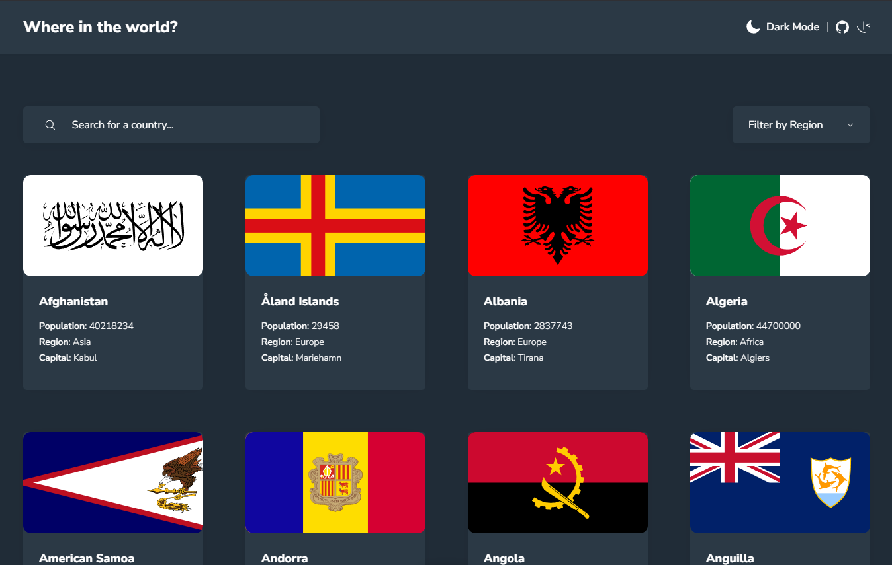

# Challenge: REST Countries API

This is a solution to the [REST Countries API with color theme switcher challenge on Frontend Mentor](https://www.frontendmentor.io/challenges/rest-countries-api-with-color-theme-switcher-5cacc469fec04111f7b848ca). Frontend Mentor challenges help me improve my coding skills by building realistic projects. 

## 🏆 Challenge

Users should be able to:

- [x] See all countries from the API on the homepage
- [x] Search for a country using an `input` field
- [x] Filter countries by region
- [x] Click on a country to see more detailed information on a separate page
- [x] Click through to the border countries on the detail page
- [x] Toggle the color scheme between light and dark mode *(optional)*

## 📦 Stack

- [**Astro**](https://kit.svelte.dev/) - Web development, streamlined.
- [**Typescript**](https://www.typescriptlang.org/) - JavaScript with syntax for types.
- [**Tailwindcss**](https://tailwindcss.com/) - A utility-first CSS framework for rapidly building custom designs.
- [**Prettier**](https://prettier.io/) + [prettier-plugin-tailwindcss](https://github.com/tailwindlabs/prettier-plugin-tailwindcss) - An opinionated code formatter.
- [**Vercel**](https://vercel.com/) - Platform for deploy your web apps faster, without the need for additional configuration.

## 🔗 Links

- Solution URL: [Add solution URL here](https://your-solution-url.com)
- Live Site URL: [Add live site URL here](https://astro-rest-countries-api.vercel.app/)

## 🔮 Continued development

- [ ] Handling of a global state so that information can be loaded with an infinite scroll or a button.
- [ ] Make some components with React to generate more radioactivity.
- [ ] Manage all the information through the API and not through the mockups.
- [ ] Add more information to the detail of the countries in order to use more information that can be seen in the mockups.

## 🤵 Author

- Frontend Mentor - [@jodadevcol](https://www.frontendmentor.io/profile/jodadevcol)

## 📑 Acknowledgments

At the end of the project I encountered some inconvenience in the navigation back, after having first a filter in the home, I do not understand the reason and I want to find a solution.

Finally, I would like to know your opinion about the project if you have any comment, criticism or doubt you can leave it in the github or through FrontMentor.

